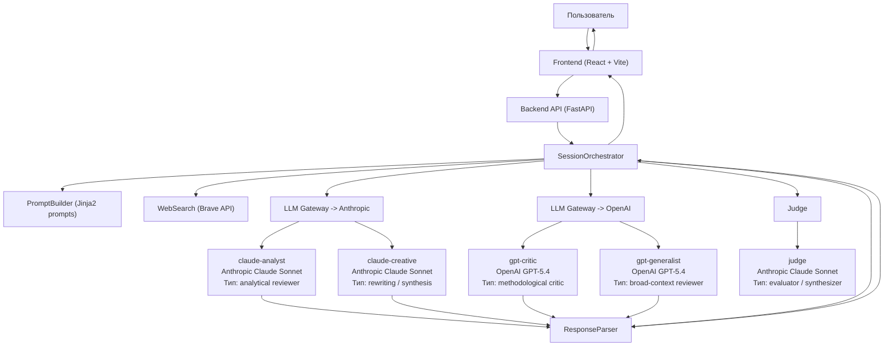
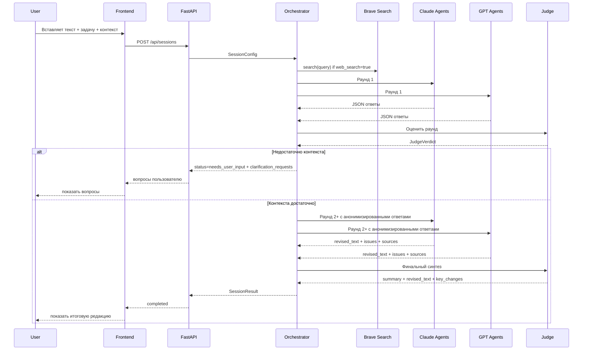

# SciProof Service Flow

## Основная схема

## Цикл работы review_text

## Какие модели используются

| Узел | Модель | Провайдер | Роль модели | Тип |
|------|--------|-----------|-------------|-----|
| `claude-analyst` | `anthropic/claude-sonnet-4-6` | Anthropic | проверка фактов, логики, доказательности | analytical reviewer |
| `claude-creative` | `anthropic/claude-sonnet-4-6` | Anthropic | переписывание, синтез, улучшение формулировок | rewriting / synthesis |
| `gpt-critic` | `openai/gpt-5.4` | OpenAI | критика допущений, структуры и аргументации | methodological critic |
| `gpt-generalist` | `openai/gpt-5.4` | OpenAI | широкий контекст, деловой и междисциплинарный взгляд | generalist reviewer |
| `judge` | `anthropic/claude-sonnet-4-6` | Anthropic | вердикт раунда, остановка, финальный синтез | evaluator / synthesizer |

## Какие виды моделей НЕ используются сейчас

- локальные модели;
- эмбеддинги;
- reranker;
- OCR / vision models;
- speech models;
- LangChain / CrewAI orchestration layers.

## Где что применяется

- Frontend: только UI, моделей нет.
- FastAPI: только API и маршрутизация, моделей нет.
- PromptBuilder: не модель, а шаблонизация промтов.
- ResponseParser: не модель, а парсинг JSON/fallback.
- WebSearch: Brave Search API, не LLM.
- LLM Gateway: единая точка вызова frontier LLM.
- Judge: отдельный LLM-вызов той же Anthropic модели, но с другой ролью.
